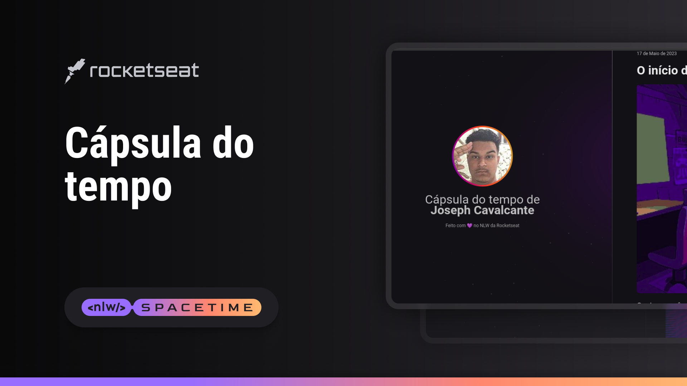

    

## 🖥️ Projeto

Esse é um projeto Web Responsivo de uma cápsula do tempo para criar memórias em uma timeline.

## 🚀 Tecnologias

Esse projeto foi desenvolvido durante o NLW Spacetime da Rocketseat usando as seguintes tecnologias:

-HTML
-CSS
-Git e HGithub
